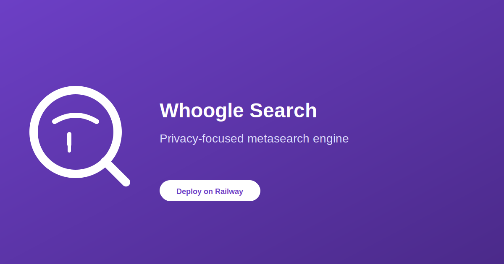

# Deploy and Host

[](https://railway.app/template/whoogle-search)



Whoogle Search is a self-hosted, ad-free, privacy-respecting metasearch engine that provides Google search results without ads, JavaScript, cookies, or IP address tracking. It runs as a single container service on Railway with no database dependencies required.

## About Hosting

Whoogle Search runs as a single container on Railway with:
- Port: 5000 (automatically mapped to Railway's dynamic port)
- No persistent storage required (optional `/config` volume for settings)
- No database needed - standalone search service
- Built-in Tor support for anonymous searching (optional)

## Why Deploy

- **Privacy First**: No cookies, no JavaScript, no IP tracking
- **Ad-Free Search**: Clean Google results without sponsored content
- **Single Container**: No external dependencies, easy deployment
- **Customizable**: Configure safe search, themes, language, and site alternatives
- **Proxy Support**: Built-in HTTP/SOCKS proxy and Tor routing support
- **Tiny Image**: ~58MB Docker image fits any Railway tier

## Common Use Cases

- Self-hosted search engine for personal or family use
- Privacy-focused browsing without Google tracking
- Alternative to commercial search engines in sensitive environments
- Research tool with configurable site alternatives
- Integration testing for privacy-focused web applications

## Dependencies for Whoogle Search

### Deployment Dependencies

No external dependencies required. Whoogle Search operates as a standalone service with no database or messaging queue needed.

---

## Features

- No ads or sponsored content in search results
- No third-party JavaScript or cookies
- Optional basic authentication
- Tor and HTTP/SOCKS proxy support
- Dark/light/system theme modes
- Site alternatives (Twitter, YouTube, Reddit, etc. via farside.link)
- Custom search engines via Google CSE (BYOK)
- Autocomplete and search suggestions

## Environment Variables

| Variable | Description | Default |
|----------|-------------|---------|
| `WHOOGLE_URL_PREFIX` | URL prefix for subpath deployments | `""` |
| `WHOOGLE_USER` | Basic auth username | (empty) |
| `WHOOGLE_PASS` | Basic auth password | (empty) |
| `WHOOGLE_CONFIG_THEME` | UI theme (light/dark/system) | `system` |
| `WHOOGLE_CONFIG_SAFE` | Enable safe search | `1` |
| `WHOOGLE_CONFIG_ALTS` | Enable site alternatives | `1` |
| `WHOOGLE_CONFIG_TOR` | Use Tor for searches | `0` |
| `WHOOGLE_CSE_API_KEY` | Google CSE API key | (empty) |
| `WHOOGLE_CSE_ID` | Google CSE ID | (empty) |
| `WHOOGLE_USE_CSE` | Enable Google CSE | (empty) |

## Local Development

```bash
# Clone and run locally
git clone https://github.com/INAPP-Mobile/railway-whoogle-search
cd railway-whoogle-search

# Build and run with Podman
podman build -t whoogle-search .
podman run -d -p 5000:5000 whoogle-search

# Access at http://localhost:5000
```

## Troubleshooting

| Issue | Solution |
|-------|----------|
| Searches return no results | Google may be blocking requests - set up a Google CSE key and configure `WHOOGLE_CSE_API_KEY` and `WHOOGLE_CSE_ID` |
| Tor not working | Check logs for Tor connection errors - may need to wait for Tor bootstrap |
| Need authentication | Set `WHOOGLE_USER` and `WHOOGLE_PASS` environment variables |

## Source

- GitHub: https://github.com/benbusby/whoogle-search
- Docker: https://hub.docker.com/r/benbusby/whoogle-search

## License

MIT License - See upstream project for license details.